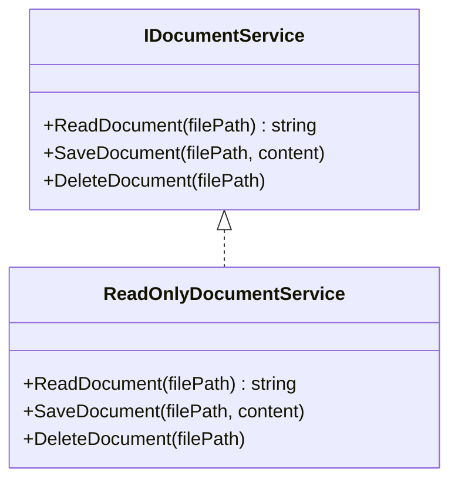
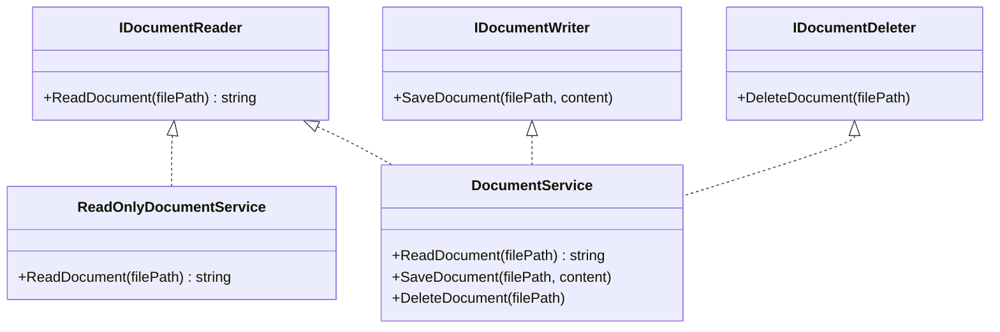

## I (Interface Segregation)　インターフェース分離の原則

一言でいうと「使わない機能にまで依存させない」。この一言が何を意味するのか、ありがちな設計のどこが困るのかから順に見ていきます。

---

## 1. 今回扱う業務

社内文書管理システムを開発するとします。

このシステムでは、次の操作を行います。

- 文書を閲覧する
- 文書を保存する
- 文書を削除する

一方で、文書を閲覧するだけのサービスも必要です。

例えば、全社員向けの文書閲覧画面では、文書の内容は表示しますが、保存や削除は行いません。

---

## 2. 問題のある設計

最初に、文書に関するすべての操作を1つのインターフェースにまとめます。

```csharp
public interface IDocumentService
{
    string ReadDocument(string filePath);
    void SaveDocument(string filePath, string content);
    void DeleteDocument(string filePath);
}
```

続いて、文書の閲覧だけを担当するクラスを作ります。

```csharp
public class ReadOnlyDocumentService : IDocumentService
{
    public string ReadDocument(string filePath)
    {
        return File.ReadAllText(filePath);
    }

    public void SaveDocument(string filePath, string content)
    {
        throw new NotSupportedException();
    }

    public void DeleteDocument(string filePath)
    {
        throw new NotSupportedException();
    }
}
```

## 3. 問題点

### 3.1 使用しないメソッドの実装を求められている

`ReadOnlyDocumentService`が必要としているのは、次のメソッドだけです。

```csharp
ReadDocument
```

しかし、`IDocumentService`を実装したため、次のメソッドも書かなければなりません。

```csharp
SaveDocument
DeleteDocument
```

閲覧だけを担当するクラスに、保存と削除の実装を求めています。

### 3.2 使用できない機能が、使用できるように見える

呼び出す側から見ると、`IDocumentService`には次の3つの操作があります。

```text
閲覧
保存
削除
```

そのため、`ReadOnlyDocumentService`でも保存や削除ができるように見えます。

しかし、実際に呼び出すと例外が発生します。

```csharp
documentService.DeleteDocument(filePath);
// 実行時にNotSupportedExceptionが発生する
```

コードを実行するまで使用できないことが分からないため、誤用につながる可能性があります。

### 3.3 関係のない変更の影響を受ける

例えば、文書の保存方法を変更するため、`IDocumentService`の保存関連メソッドを変更したとします。

閲覧しか行わないクラスであっても、同じインターフェースを実装しているため、修正の影響を受ける可能性があります。

> 閲覧機能が、保存や削除という不要な機能にまで結び付いています。

---

## 4. インターフェース分離の原則とは

いま見た問題の本質は、利用する側が`IDocumentService`に依存すると、読むだけの利用者にも保存・削除まで見えてしまうことにあります。これを一般化したものが、インターフェース分離の原則です。一般に次のように説明されます。

> クライアントは、自分が使用しないメソッドへの依存を強制されるべきではない。

実務では、

> インターフェースは、それを使うクライアントごとに小さく分けるべき。

と説明されることも多くあります。言い換えると、大きくて何でもできる1つのインターフェースより、使う人に必要なメソッドだけを持つ小さいインターフェースに分ける、という考え方です。

### 「クライアント」とは

ここでいうクライアントは、インターフェースを受け取って処理を行うクラスやメソッドなど、**そのインターフェースを利用する側のコード**を指します。

> 利用する側には、必要な機能だけを見せる。

---

## 5. ISPを適用して改善する

大きな`IDocumentService`を、役割ごとのインターフェースに分けます。

### 5.1 文書を読む役割

```csharp
public interface IDocumentReader
{
    string ReadDocument(string filePath);
}
```

### 5.2 文書を保存する役割

```csharp
public interface IDocumentWriter
{
    void SaveDocument(string filePath, string content);
}
```

### 5.3 文書を削除する役割

```csharp
public interface IDocumentDeleter
{
    void DeleteDocument(string filePath);
}
```

---

## 6. 必要なインターフェースだけを実装する

閲覧専用サービスは、`IDocumentReader`だけを実装します。

```csharp
public class ReadOnlyDocumentService : IDocumentReader
{
    public string ReadDocument(string filePath)
    {
        return File.ReadAllText(filePath);
    }
}
```

保存や削除を実装する必要がなくなりました。

また、このクラスには`SaveDocument`と`DeleteDocument`が存在しないため、呼び出す側が誤って使用することもできません。

---

## 7. 複数の役割を持つクラス

文書の閲覧・保存・削除をすべて行うクラスは、必要なインターフェースを複数実装します。

```csharp
public class DocumentService :
    IDocumentReader,
    IDocumentWriter,
    IDocumentDeleter
{
    public string ReadDocument(string filePath)
    {
        return File.ReadAllText(filePath);
    }

    public void SaveDocument(string filePath, string content)
    {
        File.WriteAllText(filePath, content);
    }

    public void DeleteDocument(string filePath)
    {
        File.Delete(filePath);
    }
}
```

クラスが複数のインターフェースを実装することで、そのクラスが担当する役割を明確にできます。

---

## 8. 利用する側も、必要な機能だけに依存する

ISPでは、実装するクラスだけでなく、**インターフェースを利用する側**も重要です。

文書を画面に表示するサービスを考えます。

```csharp
public class DocumentViewer
{
    private readonly IDocumentReader _documentReader;

    public DocumentViewer(IDocumentReader documentReader)
    {
        _documentReader = documentReader;
    }

    public void DisplayDocument(string filePath)
    {
        string content =
            _documentReader.ReadDocument(filePath);

        Console.WriteLine(content);
    }
}
```

`DocumentViewer`が行うのは、文書を読むことだけです。

そのため、次の機能には依存しません。

```text
SaveDocument
DeleteDocument
```

### 重要な点

```csharp
private readonly IDocumentReader _documentReader;
```

この宣言を見るだけで、`DocumentViewer`が文書の読み取りだけを必要としていることが分かります。

---

## 9. 改善前と改善後の図

### 9.1 改善前



閲覧専用のクラスにも、保存と削除が含まれています。

### 9.2 改善後



各クラスが、実際に提供できる役割だけを実装しています。

---

## 10. 改善前と改善後の比較

| 比較項目 | 改善前 | 改善後 |
|---|---|---|
| インターフェース | 閲覧・保存・削除を1つにまとめる | 役割ごとに分ける |
| 閲覧専用クラス | 保存・削除も実装する | 閲覧だけ実装する |
| 使用できないメソッド | 例外を投げる | そもそも公開されない |
| クラスの役割 | 分かりにくい | 分かりやすい |
| 誤操作 | 実行時まで分からない | コンパイル時に防ぎやすい |
| 変更の影響 | 無関係な機能にも広がりやすい | 関係する役割に限定しやすい |

---

## 11. ISPを適用するメリット

### 11.1 不要な依存を減らせる

利用する側は、実際に必要なメソッドだけに依存できます。

保存機能を変更しても、読み取りだけを行うコードへの影響を抑えやすくなります。

### 11.2 クラスの役割が分かりやすくなる

次の宣言を見ると、クラスが何を担当しているのかが分かります。

```csharp
public class ReadOnlyDocumentService : IDocumentReader
```

### 11.3 実行時の予期しない例外を減らせる

使用できないメソッドを最初から公開しないため、誤って呼び出して例外になる危険を減らせます。

### 11.4 テストしやすくなる

テストでは、必要な役割だけを持つ簡単なテスト用クラスを用意できます。

```csharp
public class FakeDocumentReader : IDocumentReader
{
    public string ReadDocument(string filePath)
    {
        return "テスト用の文書です";
    }
}
```

保存や削除の処理を用意する必要はありません。

### 11.5 変更の影響範囲を小さくしやすい

インターフェースが役割ごとに分かれているため、変更に関係するクラスを特定しやすくなります。

---

## 12. .NETにある身近な例

.NETには、読み取りだけを目的とした次のようなインターフェースがあります。

```csharp
IReadOnlyCollection<T>
IReadOnlyList<T>
```

一方、`IList<T>`には、要素の追加や削除などの変更操作も含まれます。

一覧を表示するだけのメソッドでは、`IList<T>`ではなく、`IReadOnlyList<T>`を受け取る方法があります。

```csharp
public void DisplayDocuments(
    IReadOnlyList<string> documentNames)
{
    foreach (string documentName in documentNames)
    {
        Console.WriteLine(documentName);
    }
}
```

このメソッドは、一覧の内容を変更しません。

`IReadOnlyList<string>`を受け取ることで、**読み取りだけを行うメソッドであることを型で表現できます**。

---

## 13. ISP違反を見つけるサイン

次のようなコードがある場合は、インターフェースが大きすぎないか確認します。

### 13.1 一部のメソッドで例外を投げている

```csharp
throw new NotSupportedException();
```

または、

```csharp
throw new NotImplementedException();
```

ただし、例外が存在するだけで必ずISP違反になるわけではありません。

複数の実装クラスで「このメソッドは使用できない」という状態が繰り返されている場合は、分割を検討するサインになります。

### 13.2 一部のメソッドしか使用していない

インターフェースには多くのメソッドがあるのに、利用する側が毎回一部しか使っていない場合です。

### 13.3 メソッドを追加すると、無関係なクラスまで修正が必要になる

新しい機能を追加しただけで、その機能を必要としない実装クラスまで変更しなければならない場合です。

### 13.4 異なる役割が混ざっている

例えば、次のような役割を1つのインターフェースにまとめている場合です。

- 文書を読み書きする
- 文書をPDFへ変換する
- 文書をメールで送信する
- 操作履歴を記録する

それぞれを利用するクラスが異なる場合は、分割を検討できます。

---

## 14. 分割しすぎにも注意する

ISPは、次のような原則ではありません。

> 1つのメソッドにつき、必ず1つのインターフェースを作る。

インターフェースを細かくしすぎると、型の数が増え、かえって全体を理解しにくくなる可能性があります。

今回の例では説明を分かりやすくするため、閲覧・保存・削除をそれぞれ分けました。

しかし実務では、保存と削除を常に同じ利用者が使用するなら、次のようにまとめる選択肢もあります。

```csharp
public interface IDocumentEditor
{
    void SaveDocument(string filePath, string content);
    void DeleteDocument(string filePath);
}
```

その場合は、次の2つに分けられます。

```text
IDocumentReader
IDocumentEditor
```

### 判断基準

インターフェースを分けるときは、メソッド数ではなく次の点を確認します。

- そのメソッドを利用する側は同じか
- 役割や目的が同じか
- 一部の実装クラスに不要なメソッドがないか
- 一緒に変更される機能か
- 分割後の方が、コードの意図を理解しやすいか
- 分割によって複雑になりすぎないか

> 小さいインターフェースが、必ずよいインターフェースとは限りません。

---

## 15. インターフェース同士を継承する方法

実務では、複数の基本的なインターフェースをまとめた上位用途のインターフェースを作ることもあります。

```csharp
public interface IDocumentManager :
    IDocumentReader,
    IDocumentWriter,
    IDocumentDeleter
{
}
```

`IDocumentManager`には、3つのインターフェースの機能が含まれます。

```text
IDocumentManager
├─ ReadDocument
├─ SaveDocument
└─ DeleteDocument
```

すべての操作が必要な処理では、`IDocumentManager`を利用できます。

```csharp
public class DocumentAdminService
{
    private readonly IDocumentManager _documentManager;

    public DocumentAdminService(
        IDocumentManager documentManager)
    {
        _documentManager = documentManager;
    }
}
```

一方、閲覧だけを行う処理では、引き続き`IDocumentReader`を利用します。

```csharp
public class DocumentViewer
{
    private readonly IDocumentReader _documentReader;
}
```

> 利用する側が必要とする、最も小さく適切なインターフェースに依存させることが重要です。

---

## 16. 実務で確認するチェックリスト

インターフェースを設計・レビューするときは、次の点を確認します。

- [ ] 利用する側が使わないメソッドを含んでいないか
- [ ] 実装できず、例外を投げているメソッドがないか
- [ ] メソッド追加時に、無関係なクラスまで修正していないか
- [ ] 1つのインターフェースに異なる役割が混ざっていないか
- [ ] 利用する側が必要とする機能を、型から読み取れるか
- [ ] 分割しすぎて、かえって理解しにくくなっていないか
- [ ] メソッド数ではなく、利用者と役割を基準に判断しているか

---

## 17. まとめ

- 大きすぎるインターフェースは、クラスや利用側に不要な依存を生む
- ISPでは、利用する側が必要とする機能だけに依存できるようにする
- 使用できないメソッドを例外で処理している場合は、設計を見直すサインになる
- インターフェースを分割すると、役割や意図をコードで表現しやすくなる
- 小さくすること自体が目的ではなく、利用者に合った単位にすることが重要
- 大きなインターフェースが必ず悪いわけではなく、すべての機能が同じ役割に必要なら問題ない

> **ISPの要点**  
> 利用する側には、その利用者が必要とする機能だけを見せる。